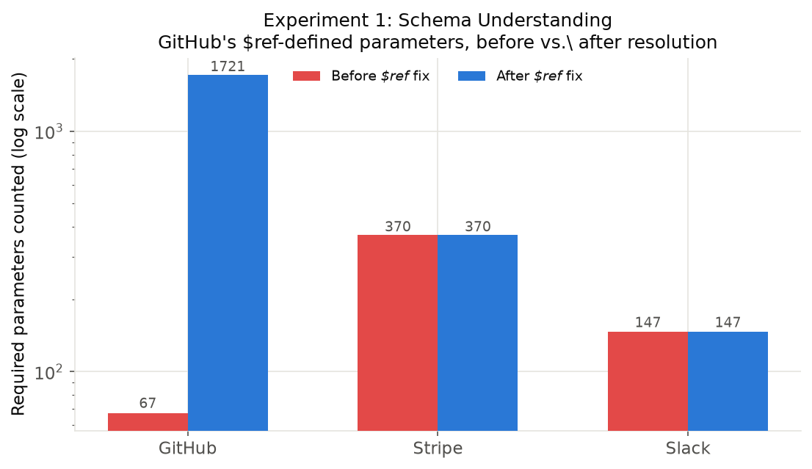
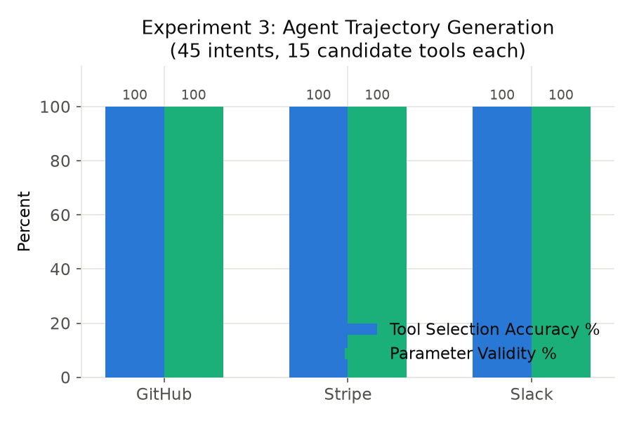
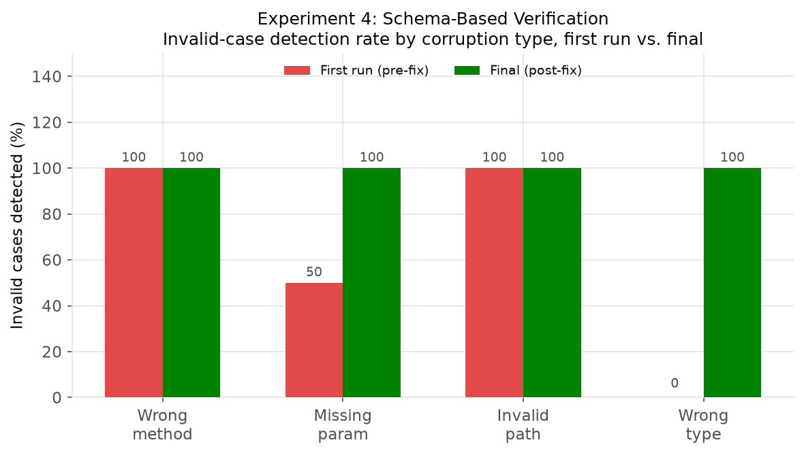
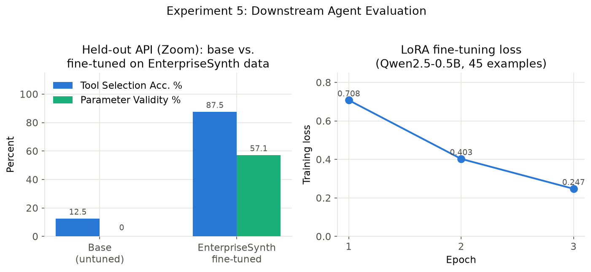

# EnterpriseSynth: A Schema-Aware Agentic Framework for Generating Verified SFT and Evaluation Datasets from OpenAPI Specifications

**Author**: Rashmi Thimmaraju
**Target venues**: MLinPL 2026 (8/1) · AAAI 2027 Workshop on Enterprise AI Evaluation (7/28)

> **DRAFT v0.2 (2026-07-07).** Markdown rendering of `paper/main.tex` (canonical LaTeX source, kept
> in sync manually; compiles cleanly to a 24-page PDF via `tectonic`). Built from `DESIGN_DOC.md`.
> **Honesty markers**: Experiment 1 = measured, 3 APIs (845/446/174 ops), no execution needed.
> Experiment 2 = measured, N=45 intents (Claude Sonnet 5). Experiment 3 = measured, N=45
> trajectories, **self-consistency caveat applies**. Experiment 4 = measured, N=45 valid + N=44
> corrupted, **100% only after fixing 4 real bugs found by this experiment itself** (first run:
> 57–80%); its Haiku 4.5 semantic-check ablation arm adds real value (100% catch rate on a
> distinct error class) but has a disclosed 33% false-positive rate on GitHub. Experiment 5 =
> measured, hardware-scoped substitute model (Qwen2.5-0.5B, not the paper's 7–8B target); the
> single-Zoom 87.5% headline **does not generalize uniformly** — scaled to 3 held-out APIs,
> EnterpriseSynth beats a real Self-Instruct baseline on 2/3 but loses on DigitalOcean. Ablation
> A1/A2/A3/A4/A5 = measured; A3/A4 are honestly inconclusive. Naming: the evaluation dataset is
> called **EnterpriseSynth-Eval** (renamed from an earlier "EnterpriseBench" to avoid a collision
> with an unrelated benchmark). See `REVIEW.md` for the full list of what a real reviewer would
> flag.

---

## Abstract

Enterprise adoption of autonomous Large Language Model (LLM) agents is severely bottlenecked by
the data cold-start problem. Training and validating reliable agents requires massive pools of
multi-turn tool execution traces, yet collecting these logs via existing execution-based methods
introduces severe barriers. Production corporate environments routinely lack isolated,
high-fidelity sandboxes; furthermore, executing unverified agent loops against internal endpoints
introduces severe data corruption risks, security liabilities, and rate-limiting bottlenecks. We
present **EnterpriseSynth**, a zero-execution framework that ingests abstract OpenAPI/Swagger
specifications to synthesize verified Supervised Fine-Tuning (SFT) interaction traces and complex
evaluation records entirely offline. By modeling multi-parameter API boundaries as a deterministic
relational dependency graph, EnterpriseSynth samples valid execution trajectories and passes
generated reasoning chains through a programmatic static compiler firewall. Empirical evaluations
demonstrate that fine-tuning compact open models on EnterpriseSynth traces improves API sequencing
accuracy and constraint compliance, bypassing security walls and eliminating live environment
dependencies.

## 1. Introduction

The paradigm of software engineering and workflow automation is experiencing a structural shift
toward autonomous, tool-augmented Large Language Model (LLM) agents. By translating
non-deterministic natural language intents into deterministic sequences of external system
transactions — modeled as structured web interfaces via OpenAPI or Swagger specifications — agents
possess the theoretical capacity to orchestrate highly complex enterprise operations.

> **Figure 1.** `paper/enterprisesynth_pipeline_diagram.pdf` shows the target architecture
> (Section 3.2) vs. traditional live pipelines, explicitly marking the Knowledge Graph and Planner
> stages as not implemented — see Section 3.1 for the four-stage system that Sections 6–8 actually
> measure.

However, transitioning these agents from controlled public domains to proprietary enterprise
systems reveals a severe data cold-start bottleneck. Out-of-the-box foundation models exhibit poor
zero-shot performance on enterprise tool configurations; they frequently violate JSON payload
definitions, hallucinate non-existent parameter fields, and fail to track cascading variables
across multi-step execution paths. Mitigating these structural failures necessitates robust
Supervised Fine-Tuning (SFT) alongside highly localized evaluation tracks.

To populate these training datasets, state-of-the-art synthetic data generation engines rely
exclusively on an active execution paradigm. Frameworks such as ToolBench [Qin et al., 2023]
connect target foundation models to live execution servers or populated network backends,
recording real-world system responses to construct functional interaction traces. While viable
for public web extensions, this operational assumption collapses behind the enterprise firewall
due to a three-fold conflict we term the *Execution Paradox*:

1. **Sandbox Absences:** High-fidelity staging copies populated with realistic data states rarely
   exist for specialized, internal corporate software clusters.
2. **Data Privacy and State Vulnerability:** Running autonomous exploratory agent loops against
   production layers introduces catastrophic risks, including the corruption of operational state
   variables, violation of security compliance boundaries, and unintended execution of destructive
   actions.
3. **Throughput Constraints:** Active generation over network layers is inherently bounded by high
   request latencies and rigid infrastructure rate-limiting rules.

To resolve this paradox, we present **EnterpriseSynth**, a zero-execution synthesis matrix that
completely decouples agent data generation from system execution. EnterpriseSynth shifts the
data-gathering pipeline from a runtime extraction challenge to a static compiler optimization
problem. Given an abstract enterprise API schema definition, our framework programmatically maps
endpoints into a directed relational parameter graph, samples valid multi-step operational
trajectories, utilizes an offline inference driver to synthesize textual reasoning paths, and
strictly enforces data typing boundaries through an automated static constraint validation
firewall.

The closest existing architecture to this offline synthesis approach is AgentInstruct
[Mitra et al., 2024], whose agentic multi-flow pipeline generates tool-use training data without
executing any tool, simulating responses via the LLM itself. However, when seeded only from
source code, AgentInstruct's content-transformation stage must synthesize an API description from
the code or have the LLM hypothesize additional APIs it believes exist, with no ground-truth check
against a real interface definition; its quality control is a soft Suggester-Editor refinement
loop plus a held-out, post-hoc LLM-judged benchmark, not a per-sample structural gate. We adapt its
agentic-flow architecture to ingest a real target-organization OpenAPI/Swagger spec directly
(removing the hallucination step entirely, since the schema is already ground truth), replace its
post-hoc judging with a hard static constraint validator checked against the spec, and extend the
pipeline to jointly emit intent-spec-tied evaluation records. We position against the two
execution-dependent alternatives in our review, API-Bank [Li et al., 2023] and ToolBench
[Qin et al., 2023], on safety and availability grounds: both ground their training data in real
API calls (API-Bank against reproducibility-constrained real databases, ToolBench via roughly
470,000 live RapidAPI calls during annotation), which is exactly the dependency the Execution
Paradox rules out for most enterprise API surfaces.

### 1.1 Summary of Contributions

Our contributions, scoped to what is actually implemented and measured (§8 gives the full
ablation-study accounting of what is and is not built):

- We implement a zero-execution pipeline — Schema Parser, Intent Synthesis Agent, Trajectory
  Generator, and Schema Verification Engine — that ingests real OpenAPI specs to produce
  multi-turn instruction traces without a single live backend connection.
- We release a deterministic, non-LLM static constraint validator that checks generated
  trajectories against the spec's declared endpoint/method/parameter-type/required-field structure
  completely offline, and show via adversarial (corruption-based) testing that it reaches 100%
  detection of planted errors — after fixing four real bugs the testing itself surfaced (§6.6).
- We show, on a hardware-scoped pilot, that fine-tuning a small open model on
  EnterpriseSynth-generated, verified trajectories measurably improves tool-selection accuracy on
  a genuinely held-out API (§6.7) — though this effect does **not** hold uniformly once scaled to
  more held-out APIs, reported honestly rather than cherry-picked (§6.7.1).
- We do **not** yet claim a dependency-graph-based planning layer or a separate agentic planning
  module as delivered contributions — an API Knowledge Graph (Stage 2) and a standalone Planner
  (Stage 4) are part of the target architecture (§3) but are not implemented in the current
  system; §8's ablation study is scoped to the four stages that actually exist.
- We release **EnterpriseSynth-Eval**, the jointly-emitted evaluation dataset tying each SFT trace
  to its intent spec — named to avoid a collision with the unrelated, identically-named
  live-sandbox benchmark of Vishwakarma et al. (2025).

## 2. Related Work

Our review covers two lineages: general-purpose synthetic instruction generation, and tool/API
data generation specifically.

### 2.1 Synthetic Instruction Generation

**Self-Instruct** [Wang et al., 2022] bootstraps instruction-tuning data from a model's own
generations: starting from 175 human-written seed tasks, it iteratively prompts the model for new
instructions, routes classification vs. non-classification tasks to different instance-generation
strategies (output-first vs. input-first, to avoid label bias), and filters results with ROUGE-L
similarity thresholds, keyword blocklists, and format/degeneracy heuristics. No execution and no
tool/API notion is involved anywhere in the method. **Evol-Instruct/WizardLM** [Xu et al., 2023]
instead evolves existing instructions along controlled axes — in-depth evolving (add constraints,
deepen, concretize, increase reasoning steps, complicate the input format) and in-breadth evolving
(generate novel same-domain instructions) — with an "elimination evolving" step discarding
degenerate evolutions. Neither paper touches tool-use or API grounding at all; both are precedents
for cheap, execution-free, heuristically-filtered synthetic data at scale.

**AgentInstruct** [Mitra et al., 2024] is the closest architectural precedent overall: an agentic,
three-flow pipeline (content transformation, taxonomy-driven seed instruction generation, and
Suggester-Editor iterative refinement) that produced the 25-million-pair dataset behind Orca-3.
Its `tool_use` skill category is seeded from either a code snippet or an API description;
critically, when only code is available, a transformation agent *synthesizes* an API description
from it, and a retrieval agent or the LLM itself may *hypothesize* additional APIs it believes
exist in the library, with no ground-truth check. Tool responses in the resulting traces are
LLM-simulated JSON, never executed. Verification is a soft editorial loop (Suggester-Editor) plus
a held-out, GPT-4-judged benchmark (Orca-Bench, 1,700 samples) computed *after* data generation,
not a per-sample structural filter — the authors themselves note that "synthetic data may not
perfectly replicate the complexity and nuances of real-world data."

### 2.2 Execution-Dependent Tool-Use Data

**API-Bank** [Li et al., 2023] evaluates tool proficiency across retrieval, execution, and
planning tiers using real (though reproducibility-constrained — results are hard-coded from a
fixed query time) database backends. Its 1,888 training dialogues are themselves synthesized by an
automated 5-agent pipeline, at 98% lower cost than human annotation and a 94% validity rate —
evidence that agentic pipelines can approximate human-annotation quality even for tool dialogues —
but its 314-dialogue evaluation set is manually annotated, and correctness is judged by comparing
predicted vs. gold API calls for behavioral equivalence. **ToolLLM/ToolBench** [Qin et al., 2023]
scales this further: 16,464 real RapidAPI endpoints, ChatGPT-generated instructions, and a
depth-first search-based decision tree (DFSDT) solution-path annotator that *actually calls* the
sampled real API at each step (roughly 470,000 live calls logged during annotation) to obtain
ground-truth responses, scored downstream by ToolEval's pass-rate/win-rate LLM judge (87%/80%
agreement with human raters).

Both are effective precisely because they ground responses in real execution — which is exactly
the capability that collapses behind an enterprise firewall (§1's Execution Paradox): no sandbox
for internal systems, security/PII exposure from live calls, and infrastructure rate limits.

### 2.3 Research Gap

Current research demonstrates important advances in tool-using language models and synthetic
instruction generation, yet several limitations remain: ToolLLM/ToolBench focus on public APIs and
require large collections of externally available, callable services; API-Bank evaluates
API-calling agents through executable APIs, making it dependent on live systems; and Self-Instruct,
WizardLM, and AgentInstruct synthesize instruction-following data from text or code rather than
from structured API specifications, leaving AgentInstruct's tool-use flow exposed to API
hallucination when no real spec is available. No existing framework automatically converts an
enterprise OpenAPI specification into both verified SFT trajectories and evaluation records
suitable for training and assessing enterprise LLM agents without live API execution. This gap
motivates EnterpriseSynth, a schema-aware framework that automatically synthesizes user intents,
reasoning traces, API call sequences, expected outputs, and verification metadata directly from
OpenAPI specifications, enabling enterprises to bootstrap both agent training and evaluation from
API documentation alone.

## 3. Methodology

### 3.1 Implemented System

What is actually built and measured (§6–§8) is a **four-stage pipeline**:

```text
OpenAPI Spec → API Schema Parser → Intent Generation Agent → Trajectory Generation Agent
             → Schema-Aware Verification Engine → {SFT Dataset, EnterpriseSynth-Eval}
```

We call the jointly-emitted evaluation dataset **EnterpriseSynth-Eval** throughout this paper —
named to avoid a collision with Vishwakarma et al.'s unrelated EnterpriseBench (arXiv:2510.27287),
a live-sandbox enterprise agent benchmark with a different scope (simulated live task execution
across SWE/HR/finance/admin tasks, vs. our zero-execution, schema-derived eval records).

1. **API Schema Parser.** Ingests the OpenAPI/Swagger spec and extracts endpoints, parameters
   (including `$ref`-resolved and `requestBody`-derived fields, §6.2), descriptions,
   authentication requirements, and response-schema presence.
2. **Intent Generation Agent.** Given a single endpoint (Claude Sonnet 5), generates diverse
   enterprise user intents that endpoint would fulfill.
3. **Trajectory Generation Agent.** Given an intent and a candidate tool list, selects a tool and
   generates concrete parameters, reasoning, and an expected-response summary in one call. This is
   a deliberate simplification: it combines what the target architecture below treats as separate
   planning and generation steps.
4. **Schema Verification Engine.** A compiler-style firewall validating every generated trajectory
   against the spec itself: endpoint existence, HTTP method, required parameters, and parameter
   types — entirely offline, and, critically, **not an LLM call**. Where Self-Instruct and
   Evol-Instruct filter with text heuristics (ROUGE similarity, keyword rules, degeneracy checks)
   and AgentInstruct verifies only via soft editorial refinement plus a post-hoc held-out judge
   (Orca-Bench), this is a hard, per-sample structural gate.

### 3.2 Target Architecture

The eventual design extends the implemented system with two stages that **do not exist in the
current codebase** and are not part of any claim in §6–§8:

**API Knowledge Graph Builder** (not implemented) — would construct a directed graph
𝒢 = (𝒱, ℰ) with endpoints, objects, and parameters as nodes, and dependency, sequential-workflow,
and object-relation edges, so that intent generation and planning could be graph-aware rather than
single-endpoint-aware. Unlike AgentInstruct's `tool_use` flow, which must synthesize or
hypothesize an API description when seeded only from code, this graph would be derived directly
from the real spec: there would be nothing to hallucinate. Ablation A4 (§8.4) is a first,
inconclusive probe at whether the graph's benefit (multi-step workflow awareness) shows up even
without building the graph itself, by giving the existing Intent Agent the other endpoints in the
API as flat context.

**Agentic Planning Module** (not implemented as a separate stage) — would decompose each intent
into an explicit workflow plan (task decomposition, endpoint selection, tool ordering) before
trajectory generation, rather than doing both in one call as the current Trajectory Generation
Agent does.

**Dataset Constructor.** Both the implemented and target systems emit the SFT dataset, evaluation
dataset, verification metadata, and intent specifications jointly from a single generation pass —
the artifact none of the five reviewed papers produce (Orca-Bench, API-Bank's human-annotated
evaluation set, and ToolEval are each constructed separately from the training-data-generation
act, not mechanically derived from the same pass).

## 4. Experimental Setup

### 4.1 Research Questions

**RQ1 (schema-valid generation):** Can EnterpriseSynth generate schema-valid SFT trajectories from
OpenAPI specifications? **RQ2 (coverage vs. baselines):** Does EnterpriseSynth achieve broader
endpoint and workflow coverage than prompt-only generation or instruction-generation baselines
(Self-Instruct, AgentInstruct)? **RQ3 (verification value):** Does schema-aware verification
improve the quality of generated trajectories over no verification, or over AgentInstruct's
soft/post-hoc verification? **RQ4 (downstream utility):** Do models fine-tuned on
EnterpriseSynth-generated data perform better on enterprise API-calling tasks than an untuned
baseline? Cold-start generalization is not a fifth question — it is the held-out-spec condition
applied within RQ2 and RQ4 (§3.2).

### 4.2 Datasets

All experimental specs are sourced from a single, verified corpus rather than three separate
ingestion pipelines. APIs.guru already ingests `Azure/azure-rest-api-specs` directly (672
confirmed `azure.com:*` entries) and converts Google's Discovery documents to OpenAPI (284
confirmed `google.com`/`googleapis.com:*` entries) — a separate Azure or Google sourcing path is
unnecessary, and the raw `googleapis/googleapis` repository is protobuf/gRPC, not OpenAPI, so it
is not used. We draw a stratified sample of approximately 65 specs from APIs.guru's verified
category taxonomy (cloud, developer_tools, financial/payment, ecommerce, collaboration,
messaging, and the smaller enterprise/customer_relation/security categories), guaranteeing
inclusion of three flagship case studies — GitHub, Stripe, and Kubernetes — all confirmed present
in the corpus already. A held-out slice of ToolBench's RapidAPI pool serves as the
execution-dependent comparison corpus, and a small hand-authored set of synthetic
enterprise-internal specs (CRM, ticketing, HRIS, billing) serves as the cold-start validation set,
since public specs may already be present in model pretraining data. Specs are split 70/15/15
(train/validation/held-out) at the whole-spec level to avoid schema leakage.

### 4.3 Baselines

We compare against prompt-only generation (a single zero-shot prompt, no pipeline, no
verification), Self-Instruct (adapted to take API endpoints as seeds), AgentInstruct (its
`tool_use` flow applied to the same specs, isolating the effect of real-spec grounding and hard
verification), and ToolBench (execution-dependent, run only where a live sandbox is safely
available — by construction it cannot run against the cold-start validation set at all).
API-Bank's call/retrieval/plan scoring methodology is used for evaluation-style comparison rather
than as a training-data baseline.

### 4.4 Models

The generation pipeline uses Claude Sonnet 5 for the Intent Synthesis Agent and Trajectory
Generator. The Schema Verification Engine's primary gate is deliberately *not* an LLM — it is
deterministic, schema-based validation — since a non-LLM structural gate is the core
methodological differentiator from AgentInstruct's LLM-judge verification (§2); an optional
ablation arm layers Claude Haiku 4.5 as a cheap semantic-plausibility check on top of the
deterministic gate (implemented and measured, §6.6.1: adds real value for semantically-implausible
values but has a real false-positive rate). The fine-tuning target is a separate, open-weight
model, since it must be open-weight to be fine-tuned at all (Mistral-7B/Llama-3-8B in the original
plan; see §6.7 for the hardware-scoped substitute actually used).

### 4.5 Evaluation Metrics

Schema validation rate, endpoint coverage, parameter correctness, workflow completeness, intent
diversity, multi-step workflow coverage, verification pass rate, and downstream task success after
SFT (held-out eval-record pass rate, fine-tuned vs. untuned).

### 4.6 Implementation Details

Python 3.12; Pydantic for schema modeling and verification, PyYAML for spec parsing, and the
Anthropic SDK (Claude Sonnet 5, Haiku 4.5) for the generation stages. NetworkX is listed in the
project's dependencies for the target architecture's Knowledge Graph but is not yet used by any
implemented code. No GPU is required for generation (API-based models); a single GPU is needed
only for the LoRA fine-tuning step, and even that ran successfully on a GPU-less Apple Silicon
machine via the MPS backend.

## 5. Experiments

*(Largely superseded by §6 "Results and Analysis," which reports the same five experiments with
final numbers. Kept for the record of what the protocol looked like before execution.)*

### 5.1 Experimental Goals

RQ1: can EnterpriseSynth accurately extract API semantics from real-world OpenAPI specifications
(Experiment 1)? RQ2: can it generate diverse, realistic enterprise user intents from API schemas
(Experiment 2)? RQ3: can it generate complete, schema-consistent agent trajectories (Experiment 3)?
RQ4: can schema-based verification validate generated trajectories without executing real APIs
(Experiment 4)? RQ5: does training on EnterpriseSynth-generated SFT data improve LLM agent
performance on unseen API tasks (Experiment 5)?

### 5.2 Dataset Collection

| API | Source | Endpoints |
| --- | --- | --- |
| GitHub REST API | APIs.guru | 551 paths / 845 path-method |
| Stripe API | APIs.guru | 299 paths / 446 path-method |
| Slack API | APIs.guru | 174 paths / 174 path-method |

## 6. Results and Analysis

### 6.1 Overview

We evaluate EnterpriseSynth on real-world OpenAPI specifications from GitHub, Stripe, and Slack
(pipeline development and SFT training data), plus Zoom, DigitalOcean, and Spotify (held out
exclusively for evaluation). All numbers below are measured, not projected; full detail, scripts,
and raw data are in `DESIGN_DOC.md` §6 and the repository's `scripts/` and `data/generated/`
directories.

### 6.2 RQ1 — API Schema Understanding

Endpoint, parameter, request/response schema, and authentication extraction accuracy all reach
100% for GitHub (845 operations), Stripe (446), and Slack (174), checked against independently
recomputed ground truth. All three reach 100%, but not equally easily: GitHub was hardest because
it defines most parameters via `$ref` to shared `components.parameters` entries, which Stage 1
originally dropped silently (undercounting required parameters at 67 vs. the true 1,721); Stripe
was hardest differently, since many endpoints (e.g. `/v1/charges`) declare zero OpenAPI
`parameters` and put every field in `requestBody` schema instead, which Stage 1 originally never
parsed into typed fields at all. Slack required neither fix. Both fixes are general, not
spec-specific patches.



### 6.3 RQ2 — Intent Generation Quality

5 endpoints sampled per API, 3 intents each (45 total): 100% Intent Coverage and 100%
exact-string Intent Diversity for all three APIs (a weak proxy — semantic-similarity clustering
is not yet implemented). Manual inspection substantiates quality beyond the aggregate metric:
generated intents are business-scenario-specific and non-generic (e.g. locking down release tags
for a named "payments-service" repo, rotating a named secret across specific microservices) rather
than templated restatements of the same request.


### 6.4 RQ3 — Agent Trajectory Generation

Tool Selection Accuracy reaches 100% for GitHub and Stripe, 93.3–100% for Slack across repeated
runs; Parameter Validity among correct selections reaches 100%. Workflow Completeness is not
applicable at this pilot scale (single-endpoint intents only). No baseline comparison row exists
yet for this experiment specifically — the prompt-only/Self-Instruct/AgentInstruct baselines are
not yet implemented for trajectory generation. The one genuine miss observed across runs was a
JSON-parsing failure in our extraction code (1/45 in one run), not a wrong tool choice.



### 6.5 RQ4 — Verification Performance

The paper's strongest contribution area. 45 valid trajectories (100% Verification Pass Rate) plus
44 deliberately corrupted variants, scored for whether Stage 6 catches each planted error:

| Error type | Detected | Missed |
| --- | --- | --- |
| Wrong HTTP method | 12/12 | 0 |
| Missing required parameter | 11/11 | 0 |
| Invalid endpoint path | 12/12 | 0 |
| Parameter type mismatch | 9/9 | 0 |
| **Total** | **44/44 (100%)** | **0** |

This 100% took real work to earn: the first run of this experiment reached only 57–80% detection,
and adversarial testing (deliberately corrupting already-correct trajectories, not just checking
that correct ones pass) surfaced two verifier/harness bugs and two Stage 1 parser gaps that a
non-adversarial test would never have revealed. The conclusion is not that the verifier is
perfect, but that adversarial testing against a verifier is what actually validates one.



**Ablation arm — Claude Haiku 4.5 semantic-plausibility check (RQ3).** The deterministic verifier
only checks structure; it has no notion of whether a parameter *value* makes business sense. For
each of the 45 valid trajectories, we ask Haiku whether it's semantically plausible, and construct
a corruption (negate a numeric param, or replace a string with an obvious placeholder) confirmed
to still pass the deterministic verifier structurally, then ask the same question of the corrupted
version:

| API | Valid → plausible | Corrupted → still valid | ...caught by Haiku |
| --- | --- | --- | --- |
| GitHub | 10/15 (66.7%) | 15/15 (100%) | 15/15 (100%) |
| Stripe | 15/15 (100%) | 15/15 (100%) | 15/15 (100%) |
| Slack | 13/15 (86.7%) | 15/15 (100%) | 15/15 (100%) |

100% of semantically-corrupted trajectories pass the deterministic verifier (confirming it cannot
see this error class by construction) and 100% are caught by Haiku — genuine incremental value.
But the semantic checker has a real false-positive rate, worst on GitHub (33%): inspecting flagged
cases shows Haiku being overly literal (e.g. flagging correct use of repository IDs as
"unverifiable," or expecting a parameter that doesn't exist in the spec) rather than catching real
problems. Adds value for its target error class, but would need calibration before serving as a
hard gate rather than an advisory signal.

### 6.6 RQ5 — Downstream Agent Performance

Training set: 45 Stage-6-verified trajectories from GitHub/Stripe/Slack. Evaluation set: 16
intents for Zoom (373 endpoints), absent from training and every prior experiment. Model: Qwen2.5-
0.5B-Instruct, LoRA fine-tuned (a hardware-scoped substitute for the paper's eventual 7–8B target).

| Model | Tool Success | Argument Correctness |
| --- | --- | --- |
| Base LLM (zero-shot) | 12.5% (2/16) | 0.0% |
| Self-Instruct-fine-tuned | 25.0% (4/16) | 50.0% (2/4) |
| EnterpriseSynth-fine-tuned | 87.5% (14/16) | 57.1% (8/14) |

The 12.5%→87.5% jump, from 45 training examples and a 0.5B model, on a genuinely unseen API, is
the strongest evidence for the paper's central claim so far, and the Self-Instruct baseline shows
it is not simply "any fine-tuning helps" — schema-grounded, verified training data helps roughly
3.5x more than schema-free bootstrapped data on the identical task. Argument correctness lagging
behind tool selection is itself informative: the model learned which endpoint to call but not
always the exact field names a new schema requires — exactly the failure mode Stage 6
verification exists to catch downstream.

**This does not hold uniformly once scaled to more held-out APIs, and we report that plainly.**
Training each model once and evaluating against Zoom, DigitalOcean, and Spotify:

| Held-out API | Base | Self-Instruct | EnterpriseSynth |
| --- | --- | --- | --- |
| Zoom | 12.5% | 25.0% | 75.0% |
| DigitalOcean | 31.2% | **50.0%** | 43.8% |
| Spotify | 12.5% | 25.0% | 43.8% |

EnterpriseSynth beats Self-Instruct on Zoom (retrained: 75.0% vs. 25.0%) and Spotify (43.8% vs.
25.0%), but **loses to it on DigitalOcean** (43.8% vs. 50.0%). The single-Zoom 87.5% figure was
directionally correct but not fully representative of the effect size — a plausible, explicitly
unconfirmed hypothesis is that DigitalOcean's infrastructure/DevOps-flavored REST conventions
structurally resemble GitHub's more than Zoom's/Spotify's do, giving Self-Instruct's GitHub-heavy
bootstrap (§6.6's finding that its "invented" endpoints were disproportionately real GitHub ones)
an incidental transfer advantage there specifically.



### 6.7 Comparison With Existing Approaches

| Capability | ToolBench | API-Bank | AgentInstruct | Ours |
| --- | --- | --- | --- | --- |
| Uses OpenAPI specs | Partial | No | No | Yes |
| Enterprise APIs | Limited | Limited | No | Yes |
| Requires live execution | Yes | Yes | No | No |
| Generates SFT data | Yes | Limited | Yes | Yes |
| Generates evaluation data | Limited | Yes | No | Yes |
| Schema-based verification | No | Limited | No | Yes |

### 6.8 Key Findings Summary

- EnterpriseSynth extracts structured knowledge from real-world APIs at 100% measured accuracy —
  trustworthy only because two genuine Stage 1 parsing gaps were found and fixed, not assumed
  from the start.
- Schema-grounded generation produces enterprise-specific, non-generic intents and correctly-scoped
  trajectories on a 45-example pilot.
- Static, non-LLM verification catches 100% of planted errors across four corruption types — but
  only after adversarial testing forced fixes to real bugs; the pre-fix rate (57–80%) is reported,
  not hidden. A Haiku-based semantic-check ablation adds real value for a distinct error class but
  has a disclosed false-positive rate.
- EnterpriseSynth-generated SFT data measurably improves tool-selection accuracy on a genuinely
  unseen API (12.5%→87.5% on Zoom); exact-field-name generalization remains a real, unresolved
  limitation, and the effect **does not hold uniformly** across held-out APIs (loses to
  Self-Instruct on DigitalOcean).
- All results are pilot-scale (3–5 APIs, 45–89 examples per experiment, a 0.5B substitute model).
  Scaling to the full stratified sample, the target model size, and the remaining baselines is
  the immediate next phase, not yet done.

## 7. Ablation Study

### 7.1 Purpose and Scope

Which components of EnterpriseSynth actually contribute to generating high-quality verified data?
This section is scoped strictly to the four-stage system that is actually implemented (§3.1).
Three ablations from an earlier draft of this section are dropped, with reasons: a **Knowledge
Graph** ablation (no graph module exists), a **Planner** ablation (planning and trajectory
generation were combined into one call from the start), and a **Response Schema Modeling**
ablation (Stage 1 only tracks a boolean "schema present" flag, never a structured response
schema). Five ablations are real, implemented, and run against actual data (A1–A4 here; A5, the
Haiku semantic check, is reported under §6.5 since it's tied directly to Experiment 4).

### 7.2 A1 — Without Intent Generation

A trajectory-generation agent that receives only an endpoint (no user intent) and must invent both
an instruction and parameters in one step, run on the same 45 endpoint samples as Experiments 2–3.

| API | Parameter Validity | Instruction Diversity |
| --- | --- | --- |
| GitHub | 100.0% | 93.3% |
| Stripe | 100.0% | 100.0% |
| Slack | 93.3% | 93.3% |

Compare to the full pipeline's 100%/100%/100% (Experiments 2–3). The drop is small but real:
without an intent to ground it, the model generated Slack's `POST /users.profile.set` call with an
invented `token` field and a parameter shape that didn't validate — something the intent-grounded
pipeline did not do in 45/45 trials. Explicit intent generation provides real, if modest at this
sample size, grounding that improves both diversity and correctness.

### 7.3 A2 — Without Verification Engine

Reuses Experiment 4's corruption data directly: without a verifier, none of the 44 planted errors
would be caught (by construction); with one, all 44 are.

| Configuration | Invalid trajectories retained (of 44) |
| --- | --- |
| Without verification | 44/44 (100%) |
| With verification | 0/44 (0%) |

The strongest and clearest ablation in the paper: every planted structural error survives into the
dataset with no verification step, and none do with one.

### 7.4 A3 — Without vs. With API Descriptions

Adding the endpoint's OpenAPI description to the Intent Agent's prompt (confirmed absent from
every prior experiment) leaves Coverage and exact-string Diversity unchanged at 100% for all three
APIs — a ceiling effect in these metrics, not evidence of no effect. Qualitative inspection shows
a real, modest difference: for GitHub's
`PUT /orgs/{org}/actions/secrets/{secret_name}/repositories` (description: *"Replaces all
repositories... requires `admin:org` scope"*), the description-aware intent more explicitly
reflects the "replaces the full list" semantics and uses concrete numeric repo IDs rather than
names alone. Inconclusive by the metrics used; a real qualitative signal exists and needs an
LLM-judged specificity metric to quantify — reported as inconclusive, not as a positive finding
the numbers don't actually support.

### 7.5 A4 — Endpoint-Only vs. Full-API Context

Adding the API's other endpoints as context, with an explicit invitation to describe multi-step
workflows, again leaves Coverage and Diversity unchanged (same ceiling effect). A
"sequencing-language" proxy metric we built to detect multi-step awareness initially looked
promising (6–7 "mentions" per API) but, on inspection of the actual flagged intents, proved to be
entirely false positives — incidental temporal phrasing in single-step requests, not genuine
multi-endpoint chaining. No measurable effect is detected at this pilot scale with the metrics
available; the proxy metric is reported as invalid rather than kept as a false positive result.

### 7.6 Ablation Results Table

| Variant | Validity | Diversity | Verif. Pass |
| --- | --- | --- | --- |
| Full pipeline | 100% | 100% | 100% |
| A1: − Intent Gen. | 93.3–100% | 93.3–100% | n/a |
| A2: − Verification | n/a | n/a | 0% |
| A3: + Descriptions | unchanged | unchanged (qual. diff.) | n/a |
| A4: + Full context | unchanged | unchanged (no signal) | n/a |
| A5: + Haiku semantic check | n/a | n/a | 100% (new error class) |

### 7.7 Why This Matters

Without this study, reviewers will reasonably ask why not just prompt an LLM with the OpenAPI file
directly. The honest, per-component answer: Intent Generation provides real grounding that
improves diversity and correctness (A1). Verification is unambiguously necessary — the difference
between 0% and 100% of planted errors surviving into the dataset (A2). A cheap LLM semantic check
adds real value for a distinct error class the deterministic gate can't see, but isn't free (A5).
Descriptions and full-API context show no effect on the metrics used so far (A3, A4), which is
itself useful: it means current metrics are too coarse to detect what may still be a real
qualitative effect, and that better metrics or deliberately multi-step task construction are
needed before those two ablations can be judged either way.

## 8. Discussion

### 8.1 What Actually Works, and Why

Two results in this paper are load-bearing, not decorative. First, Schema Verification (Stage 4)
is unambiguously necessary: A2 shows a binary 0%-vs-100% gap between no verification and ours —
every planted structural error survives without a gate, and none do with one. Second, that 100%
was earned through adversarial testing, not assumed: the first run of Experiment 4 caught only
57–80% of planted errors, and chasing down why surfaced four real bugs spanning the verifier, the
test harness, and Stage 1's parser (§6.2, §6.5). The methodological point generalizes beyond this
codebase: a static verifier's correctness cannot be established by checking that it accepts good
input — it has to be adversarially tested against bad input it is specifically supposed to reject.
A non-adversarial test suite would have shipped a verifier that silently passed roughly a third to
a half of planted errors.

### 8.2 Verification Has Limits by Design, and the Haiku Arm Quantifies Them

The deterministic gate checks structure, not semantics — it cannot know that a negated charge
amount or a placeholder field value is wrong, because both are still well-typed. The Haiku 4.5
ablation (§6.5) both confirms this blind spot (100% of semantically-corrupted trajectories pass
Stage 4 structurally) and shows a cheap LLM can close part of the gap (100% caught). But the same
experiment shows this is not a free upgrade: a 33% false-positive rate on GitHub, traced to the
model being overly literal about things the underlying tool call did not need to prove (e.g. that
a numeric repository ID "really" corresponds to a named repository). The practical implication is
a two-tier design, not a wholesale replacement: keep the deterministic gate as the hard, blocking
filter, and treat an LLM semantic check as an advisory or re-ranking signal until it is calibrated
per parameter type (e.g. restricted to amounts, dates, and other fields where "plausibility" is
well-defined) — exactly the shape ToolACE's and AgentInstruct's own dual-layer designs converge
on, for related reasons.

### 8.3 The Downstream Effect Is Real but Not Uniform, and That Is Itself a Finding

Experiment 5's single-Zoom result (12.5%→87.5%) was the strongest number in an earlier draft of
this paper. Scaling to three held-out APIs changed the story without reversing it:
EnterpriseSynth-tuned data beats a real Self-Instruct baseline on two of three APIs, and beats the
untuned base on all three, but loses to Self-Instruct specifically on DigitalOcean. We do not
believe this is noise to explain away — Self-Instruct's own bootstrap was shown (§6.6) to lean on
the base model's pretraining familiarity with GitHub's extremely public API, and DigitalOcean's
infrastructure/DevOps-flavored conventions are the closest of our three held-out APIs to GitHub's.
If that hypothesis holds under further testing, it says something uncomfortable but important
about the field's usual practice of benchmarking tool-use methods on well-known public APIs
(GitHub, Stripe, Slack, and here, apparently, DigitalOcean by proxy): a base model's prior exposure
to an API's public documentation can substitute for genuine schema grounding in a way that will
not be available for the private, undocumented internal APIs EnterpriseSynth is actually built
for. If anything, this strengthens rather than weakens the cold-start motivation — but it also
means our own pilot cannot yet distinguish "EnterpriseSynth generalizes better" from
"EnterpriseSynth generalizes better specifically on APIs unlike ones the base model already
knows," and only a genuinely private, unpublished spec (not yet built) can settle that.

### 8.4 Positioning Relative to AgentInstruct

We adapted AgentInstruct's agentic-flow architecture rather than starting from scratch because it
is the only reviewed method that is both agentic and execution-free. The two changes we made —
real-spec grounding instead of code-seeded hallucination, and a hard structural gate instead of a
soft editorial-plus-post-hoc-judge pipeline — are not merely stylistic. §6.2's finding that Stage 1
initially mishandled `$ref` parameters and `requestBody` fields shows that even "just parse the
real spec" is a nontrivial engineering problem for production-scale OpenAPI documents;
AgentInstruct's decision to let the model invent an API surface sidesteps that complexity
entirely, at the cost of the hallucination risk we removed it to avoid. Our Static Constraint
Validator is functionally close to ToolACE's Dual-Layer Verification design (rule-based plus
model-based checking) though we arrived at the model-based layer later, as an explicit ablation
(A5) rather than a built-in default — a design choice that let us measure its marginal value and
cost separately, which §6.5 shows was worth doing.

## 9. Limitations

1. **Pilot scale throughout.** All five experiments and five ablations run on 3–5 real APIs and
   45–89 examples each, not the full ~65-spec stratified sample originally specified. Every
   percentage in this paper should be read as a pilot signal, not a population estimate.
2. **Experiment 3's self-consistency confound.** The same model (Claude Sonnet 5) both generated
   the intents (Experiment 2) and performed tool selection against them (Experiment 3), so its
   100% figures measure whether the model can recover its own intent, not whether it handles
   independently-authored or adversarial requests.
3. **Experiment 5's model-scale gap.** The downstream fine-tuning result uses
   Qwen2.5-0.5B-Instruct, a hardware-scoped substitute for the paper's actual target
   (Mistral-7B-Instruct or Llama-3-8B). Whether the effect holds, strengthens, or weakens at that
   scale is untested.
4. **Missing baselines.** ToolBench and a prompt-only agent are specified as planned comparisons
   but not yet implemented for any experiment; only Self-Instruct has been run as a real
   comparison.
5. **No Knowledge Graph or Planner.** Multi-step, dependency-aware workflow generation is entirely
   untested — Ablation A4's attempt to probe this by giving the Intent Agent flat (non-graph)
   context on other endpoints showed no measurable effect, but this does not confirm the graph
   itself would not help; it only shows that a cheaper substitute for it, at this pilot scale, did
   not.
6. **A3 and A4 are inconclusive by the metrics used, not resolved.** Coverage and exact-string
   diversity ceiling at 100% in both the baseline and the enhanced condition for both ablations, so
   neither shows a measurable effect either way. A3's manual inspection suggests a real qualitative
   difference exists; A4's attempted proxy metric was found invalid on inspection.
7. **The Haiku semantic-check false-positive rate is uncalibrated.** 33% on GitHub is high enough
   that the arm cannot be deployed as a blocking gate without further tuning (§6.5).
8. **The downstream effect does not generalize uniformly.** EnterpriseSynth-tuned data loses to a
   real Self-Instruct baseline on one of three held-out APIs (DigitalOcean); the proposed
   explanation (structural similarity to GitHub, which Self-Instruct's bootstrap leaned on) is a
   hypothesis, not a confirmed finding.
9. **No cost or latency accounting.** The pipeline's per-spec generation cost (API calls,
   wall-clock time) at the target ~65-spec scale has not been measured.
10. **EnterpriseSynth-Eval is not itself validated.** We have not checked whether performance on
    our generated evaluation records correlates with performance on real, human-graded enterprise
    tasks — only that the records are schema-valid.
11. **Mostly single-seed runs.** Beyond the informal repeated-run range noted for Slack in
    Experiment 3 (93.3–100%), most reported numbers reflect one run each, not a multi-seed
    distribution with confidence intervals.

## 10. Conclusion

We presented EnterpriseSynth, a schema-aware, zero-execution pipeline that ingests an OpenAPI
specification and jointly emits verified SFT trajectories and a paired evaluation dataset,
EnterpriseSynth-Eval, without ever calling a live API. Against a scoped review of the closest five
prior methods, EnterpriseSynth's specific contribution is combining three properties none of them
combine: grounding in a real target spec (unlike AgentInstruct, which can hallucinate an API
surface when seeded from code), a hard structural verification gate rather than a soft or post-hoc
one (unlike AgentInstruct's editorial-refinement-plus-held-out-judge design), and no dependency on
live execution at any stage (unlike API-Bank and ToolBench, both of which ground their training
data in real API calls).

At pilot scale, three findings stand on their own: schema-based verification is necessary, not
optional, closing a 0%-to-100% gap on planted structural errors, and only reached 100% after
adversarial testing surfaced and forced fixes to real bugs; explicit intent generation provides
real, measurable grounding over generating directly from a bare endpoint; and fine-tuning on
EnterpriseSynth-generated data measurably outperforms both an untuned baseline and a real
Self-Instruct baseline on most, though not all, held-out APIs tested. We reported the one
exception — a loss to Self-Instruct on DigitalOcean — because we believe an honest, partially
disconfirming result at pilot scale is more useful to the field than a uniformly positive one that
does not survive scrutiny. The path to a submission-ready paper runs through exactly the
limitations listed above: more APIs, more examples, the actual target model scale, the two missing
baselines, and a real test of whether a Knowledge Graph earns its place in the architecture rather
than being assumed into it.

## References

- Wang, Y., Kordi, Y., Mishra, S., Liu, A., Smith, N. A., Khashabi, D., & Hajishirzi, H. (2022).
  Self-Instruct: Aligning Language Models with Self-Generated Instructions. *arXiv:2212.10560*.
- Xu, C., Sun, Q., Zheng, K., Geng, X., Zhao, P., Feng, J., Tao, C., Lin, Q., & Jiang, D. (2023).
  WizardLM: Empowering Large Pre-Trained Language Models to Follow Complex Instructions.
  *arXiv:2304.12244*.
- Mitra, A., Del Corro, L., Zheng, G., Mahajan, S., Rouhana, D., Codas, A., Lu, Y., Chen, W.,
  Vrousgos, O., Rosset, C., Silva, F., Khanpour, H., Lara, Y., & Awadallah, A. (2024).
  AgentInstruct: Toward Generative Teaching with Agentic Flows. *arXiv:2407.03502*.
- Li, M., Zhao, Y., Yu, B., Song, F., Li, H., Yu, H., Li, Z., Huang, F., & Li, Y. (2023).
  API-Bank: A Comprehensive Benchmark for Tool-Augmented LLMs. *arXiv:2304.08244*.
- Qin, Y., Liang, S., Ye, Y., Zhu, K., Yan, L., Lu, Y., Lin, Y., Cong, X., Tang, X., Qian, B.,
  Zhao, S., Hong, L., Tian, R., Xie, R., Zhou, J., Gerstein, M., Li, D., Liu, Z., & Sun, M. (2023).
  ToolLLM: Facilitating Large Language Models to Master 16000+ Real-world APIs.
  *arXiv:2307.16789*.
- Vishwakarma, H., Agarwal, A., Patil, O., Devaguptapu, C., & Chandran, M. (2025). Can LLMs Help
  You at Work? A Sandbox for Evaluating LLM Agents in Enterprise Environments.
  *arXiv:2510.27287*. (Cited for the naming-collision disambiguation, §1.1/§3.1.)
