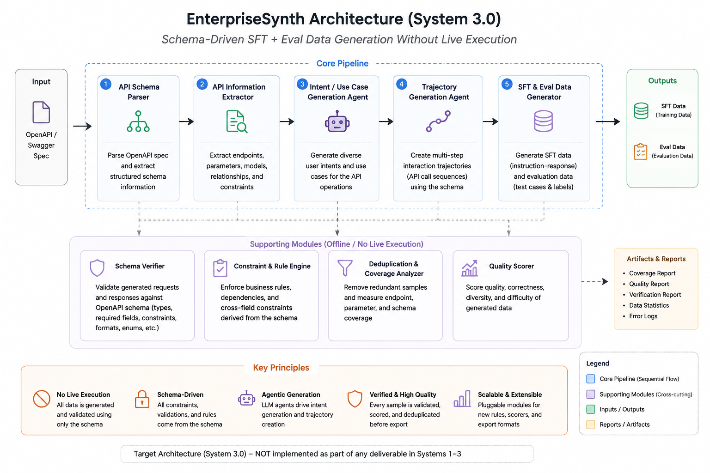

# EnterpriseSynth

[](https://github.com/anote-ai/Research-Enterprise-Synth-API/actions/workflows/ci.yml)
[](https://www.python.org/downloads/)

> **How do you generate verified, tool-use training data for an internal API that has no traffic history, no safe sandbox, and no existing SFT data — without ever calling it live?**

EnterpriseSynth is a research framework that ingests an OpenAPI/Swagger spec and emits paired,
verified SFT training traces and evaluation records — without executing a single live call
against the target API. It targets the **enterprise cold-start problem**: teams that have an API
schema but no historical tool-use data or eval suite to fine-tune or test an agent against. The
repository supports both in-repo experiment reproduction (deterministic scripts producing
committed JSON results) and paper-oriented workflows (`paper/main.tex` and `main_aaai.tex` cite
the same result files).

**Status:** pilot-scale experiments complete and scaled: Experiments 1–5, Ablation Study A1–A5, a
real Self-Instruct baseline, a 5-seed multi-API scaling sweep, a private never-published-API
cold-start validation, a 6-API real-spec scale-up (17 APIs touched by the pipeline in total), a
Case Study section with real pipeline output, and an independent LLM-as-a-judge semantic
evaluation. See [DESIGN_DOC.md](DESIGN_DOC.md) for the full design, results, and honest accounting
of what is/isn't implemented.

---

## The Problem

Fine-tuning an LLM agent to call an API reliably needs training data: instructions paired with
correct tool calls. The two existing ways to generate that data don't work behind an enterprise
firewall:

- **Execution-based generation** (API-Bank, ToolLLM/ToolBench) grounds and verifies every example
  by actually calling the API. That needs a live sandbox, which mostly doesn't exist for internal
  enterprise systems, and risks hitting production with synthetic traffic.
- **Execution-free generation** (AgentInstruct) avoids calling anything, but when it isn't seeded
  from a real spec it **hallucinates the API surface** — the LLM invents endpoints, parameters, and
  responses that don't exist — and its verification is a soft editorial pass plus a post-hoc judge,
  not a hard structural check.

A team with a brand-new internal API — a schema, but no traffic history, no sandbox, and no
existing training or eval data — has no safe way to bootstrap an agent for it. Full problem framing
against the literature ("The Execution Paradox") is in `DESIGN_DOC.md` §2.

## The Solution

EnterpriseSynth takes an OpenAPI/Swagger spec as its *only* input and emits two paired artifacts —
a verified SFT training set and an evaluation set — without ever making a live call. Grounding in
a real spec removes AgentInstruct's hallucination failure mode; a deterministic, per-sample schema
verifier (not an LLM judge) replaces execution as the correctness check.

The target design for the full system is five pipeline stages plus four supporting modules:

<p align="center">
  
</p>

**This is the target architecture — explicitly not what's built.** What's actually implemented and
measured in this repo is a narrower **four-stage** pipeline (see `DESIGN_DOC.md` §4 and §8 for the
full real-vs-planned accounting):

1. **API Schema Parser** — reads the OpenAPI/Swagger spec and extracts endpoints, parameters,
   auth requirements, and response schemas.
2. **Intent Generation Agent** — synthesizes diverse, realistic natural-language user intents for
   the parsed endpoints (Claude Sonnet 5).
3. **Trajectory Generation Agent** — turns an intent into a full trace: reasoning, the selected
   tool call, its arguments, and the expected response — picking the right endpoint out of a
   candidate list that includes distractors.
4. **Schema Verification Engine** — a deterministic, code-based gate (no LLM) that checks every
   generated trajectory against the spec itself: does the endpoint exist, is the method right, are
   required parameters present with the correct types, does the response match the schema.

There's no separate Knowledge Graph or Planning stage, no standalone Deduplication/Coverage
Analyzer or Quality Scorer module — every generated trajectory is a single endpoint call. That's
stated plainly throughout the paper rather than implied otherwise.

See [examples/end_to_end_walkthrough.md](examples/end_to_end_walkthrough.md) for one real GitHub
API endpoint followed through all four implemented stages using committed pipeline output.

---

## What This Repository Contributes

EnterpriseSynth focuses on four research questions:

- **RQ1 (feasibility):** Can structurally valid, verifiable multi-step agent traces be synthesized
  from an OpenAPI spec alone — no execution, no historical request/response data?
- **RQ2 (verification):** Does a static constraint validator (schema/type/format checking, no
  runtime calls) catch the same class of errors that execution-based verification catches, and
  where does it fall short?
- **RQ3 (utility):** Does fine-tuning a compact open model on EnterpriseSynth-generated traces
  measurably improve API sequencing accuracy versus the untuned baseline and a real Self-Instruct
  baseline?
- **RQ4 (cold-start generalization):** Given a spec the base model has plausibly never seen paired
  training data for, how well do zero-execution-generated SFT+eval pairs transfer — does this
  actually work for a *new* organization's API on day one?

The current repository includes:

- A four-stage generation pipeline (Parser → Intent Agent → Trajectory Agent → Verifier) with a
  deterministic, per-sample structural verification gate, not an LLM judge
- A real Self-Instruct baseline, reimplemented per its published protocol and fine-tuned/evaluated
  on the identical held-out set as EnterpriseSynth
- A 5-seed multi-API scaling sweep (Zoom, DigitalOcean, Spotify) with real mean ± std, not
  single-draw numbers
- A private cold-start validation set: 5 hand-authored, never-published synthetic enterprise
  specs (CRM, HRIS, Procurement, Ticketing, Asset Management) that the base model cannot have seen
  in pretraining
- A 6-API real-spec scale-up via APIs.guru (Twilio, Notion, OpenAI, Jira, Asana, Trello) — 17 total
  APIs touched by the pipeline
- An independent LLM-as-a-judge semantic evaluation (Claude Haiku 4.5) that stress-tests the
  headline accuracy numbers rather than just repeating them

---

## Current Status

| Experiment | Current status | Best entrypoint |
| --- | --- | --- |
| Exp 1: schema understanding | Measured, no API key needed | `scripts/run_experiment1.py` |
| Exp 2: intent generation | Measured (Claude Sonnet 5) | `scripts/run_experiment2.py` |
| Exp 3: trajectory generation | Measured; depends on Exp 2's output | `scripts/run_experiment3.py` |
| Exp 4: schema verification | Measured, adversarially tested | `scripts/run_experiment4.py` |
| Exp 5: downstream fine-tuning | Measured pilot + 5-seed scaling sweep | `scripts/scale_experiment5_heldout.py` |
| Ablation study A1–A5 | Measured against the real 4-stage implementation | `scripts/run_ablation_study.py`, `scripts/run_ablation_haiku.py` |
| Self-Instruct baseline | Measured, real reimplementation | `scripts/run_baseline_selfinstruct.py` |
| Private cold-start validation | Measured — 5 never-published enterprise specs | `scripts/run_private_coldstart_eval.py` |
| 6-API real-spec scale-up | Measured — Twilio/Notion/OpenAI/Jira/Asana/Trello | `scripts/run_phase3_eval.py` |
| LLM-as-a-judge semantic eval | Measured — independent stress test of headline numbers | `scripts/run_llm_judge_eval.py` |

Useful repository documents:

- [DESIGN_DOC.md](DESIGN_DOC.md) — full design, literature review, methodology, all measured results
- [RESULTS.md](RESULTS.md) — consolidated measured results, one section per experiment
- [REPRODUCIBILITY.md](REPRODUCIBILITY.md) — environment, seeds, and exact reproduction steps
- [REVIEW.md](REVIEW.md) — self-audit of the repo against its own claims
- [BLOG.md](BLOG.md) — companion blog post covering the core thesis and results
- [data/README.md](data/README.md) — dataset provenance (APIs.guru sampling, private specs)
- [examples/end_to_end_walkthrough.md](examples/end_to_end_walkthrough.md) — one real endpoint through all four stages
- [literature-review/README.md](literature-review/README.md) — the five-paper review this design is built against

---

## Current In-Repo Findings

These are the current repo-verified findings, not a claim that every paper-ready external
measurement has been finalized:

- **Verification is necessary, not optional:** 0% → 100% detection of planted structural errors,
  only reached 100% after adversarial testing surfaced and forced fixes to 4 real bugs.
- **Fine-tuning effect, 5-seed sweep:** averaged over 5 training seeds, EnterpriseSynth-tuned data
  beats both an untuned base and a real Self-Instruct baseline on all 3 public held-out APIs
  (Zoom, DigitalOcean, Spotify) — individual seeds still vary, reported honestly either way.
- **Private cold-start validation:** on 5 hand-authored, never-published enterprise API specs,
  EnterpriseSynth-tuned accuracy (40.0%) essentially matches public held-out accuracy (39.6%) — no
  meaningful degradation on APIs the base model cannot have seen in pretraining.
- **6-API real-spec scale-up:** wins on all 6 new real public APIs tested (Twilio, Notion, OpenAI,
  Jira, Asana, Trello) — 17 total APIs touched by the pipeline.
- **The honest caveat on all of the above:** an independent LLM-as-a-judge evaluation found that
  binary Tool Selection Accuracy overstates practical quality by roughly 2× — 61% of predictions
  marked "correct" by the endpoint-only metric still had a real defect, usually a missing or
  hallucinated parameter. Every accuracy number above should be read as an upper bound on
  deployment readiness, not an estimate of it.

---

## Scope and Scale Notes

- **Pilot scale, stated plainly:** 17 APIs touched by the pipeline (3 training: GitHub/Stripe/Slack;
  9 real held-out: Zoom/DigitalOcean/Spotify/Twilio/Notion/OpenAI/Jira/Asana/Trello; 5 private
  held-out: hand-authored, never-published synthetic specs), 45–89 examples per experiment, a 0.5B
  substitute model for fine-tuning — not yet the paper's target scale (full ~65-spec stratified
  sample, 7–8B model, remaining baselines). See "What's Next" in `RESULTS.md`.
- **Implemented vs. target architecture:** the four-stage pipeline (Parser → Intent Agent →
  Trajectory Agent → Verifier) is what's built and measured. The Knowledge Graph and Planning
  stages, and the Deduplication/Coverage Analyzer and Quality Scorer modules shown in the target
  architecture diagram above, are not implemented — see `DESIGN_DOC.md` §4 and §8.
- **Verification is deterministic, not LLM-based**, for the primary gate (Pydantic/JSON Schema
  against the spec). An LLM-based semantic-plausibility check (Claude Haiku 4.5) exists only as an
  optional ablation arm layered on top, not a replacement.

---

## Quickstart

Install and run the core checks:

```bash
python3 -m venv .venv
./.venv/bin/pip install -e ".[dev]"
./.venv/bin/python -m pytest tests/ -v
```

Requires `ANTHROPIC_API_KEY` in your environment (or a `.env` file at the repo root — already
gitignored) for Experiments 2, 3, 5, the ablation study, and the LLM-judge evaluation, which call
Claude Sonnet 5 or Haiku 4.5. Experiments 1 and 4 are pure code, no API key needed.

Fastest entrypoints by task:

| Goal | Command |
| --- | --- |
| Schema parsing accuracy (no API key) | `./.venv/bin/python scripts/run_experiment1.py` |
| Intent generation (needs API key) | `./.venv/bin/python scripts/run_experiment2.py` |
| Trajectory generation (needs API key; depends on Exp 2) | `./.venv/bin/python scripts/run_experiment3.py` |
| Schema verification + corruption testing (no API key; depends on Exp 3) | `./.venv/bin/python scripts/run_experiment4.py` |
| Regenerate all figures from committed data | `./.venv/bin/python scripts/make_figures.py` |
| Regenerate the target-architecture pipeline diagram | `./.venv/bin/python scripts/make_pipeline_diagram.py` |

---

## Reproducing Results

Run in order — later scripts depend on earlier ones' output.

### Experiments 1–4 (core pipeline)

```bash
./.venv/bin/python scripts/run_experiment1.py   # schema parsing, no API key needed
./.venv/bin/python scripts/run_experiment2.py   # intent generation, needs ANTHROPIC_API_KEY
./.venv/bin/python scripts/run_experiment3.py   # trajectory generation, depends on Exp 2
./.venv/bin/python scripts/run_experiment4.py   # schema verification + corruption testing, depends on Exp 3
```

### Experiment 5 (downstream fine-tuning pilot)

Needs `ANTHROPIC_API_KEY` + `torch`/`transformers`/`peft`; depends on Experiments 2–3's output;
downloads Qwen2.5-0.5B-Instruct (~1GB).

```bash
./.venv/bin/pip install torch transformers peft accelerate
./.venv/bin/python scripts/prepare_experiment5_data.py
./.venv/bin/python scripts/run_experiment5.py
```

### Ablation study

```bash
# A1/A3/A4 (needs ANTHROPIC_API_KEY; A2 reuses Experiment 4's data, no re-run needed)
./.venv/bin/python scripts/run_ablation_study.py

# A5 -- Claude Haiku 4.5 semantic-plausibility check (needs ANTHROPIC_API_KEY; depends on Exp 3)
./.venv/bin/python scripts/run_ablation_haiku.py
```

### Self-Instruct baseline

Schema-free bootstrap, then fine-tune + evaluate on the identical held-out Zoom set as
Experiment 5 (needs `ANTHROPIC_API_KEY` + `torch`/`transformers`/`peft`).

```bash
./.venv/bin/python scripts/run_baseline_selfinstruct.py
./.venv/bin/python scripts/run_baseline_selfinstruct_finetune.py
```

### Multi-API scaling sweep

Scale Experiment 5 to 3 held-out APIs (Zoom, DigitalOcean, Spotify) — needs `ANTHROPIC_API_KEY` +
`torch`/`transformers`/`peft`; retrains all three models (base/Self-Instruct/EnterpriseSynth) once.
Accepts `--seed N` (default 42); reuses committed held-out eval sets rather than regenerating them,
so a seed sweep varies only training randomness, not the eval questions.

```bash
./.venv/bin/python scripts/scale_experiment5_heldout.py --seed 42

# 5-seed sweep + aggregation (what the paper's mean +/- std table is built from)
for seed in 42 123 777 2025 9999; do
  ./.venv/bin/python scripts/scale_experiment5_heldout.py --seed $seed
done
./.venv/bin/python scripts/aggregate_multi_seed_scaling.py
```

### Private cold-start validation

Generate the 5 never-published specs (already committed under `data/specs/private/`, this
regenerates them from scratch), build a held-out eval set from them, then evaluate EnterpriseSynth
against both the public and private held-out sets.

```bash
./.venv/bin/python scripts/generate_private_specs.py
./.venv/bin/python scripts/build_private_coldstart_eval.py
./.venv/bin/python scripts/run_private_coldstart_eval.py
```

### 6-API real-spec scale-up

Scale to 6 more real public APIs (Twilio, Notion, OpenAI, Jira, Asana, Trello) via APIs.guru.

```bash
./.venv/bin/python scripts/build_phase3_eval.py
./.venv/bin/python scripts/run_phase3_eval.py
```

### LLM-as-a-judge semantic evaluation

Needs `ANTHROPIC_API_KEY`; scores real predictions from a committed seed-42 run on intent
match/argument correctness/missing parameters/reasoning quality.

```bash
./.venv/bin/python scripts/run_llm_judge_eval.py
```

### Figures and diagrams

```bash
./.venv/bin/pip install matplotlib
./.venv/bin/python scripts/make_figures.py             # regenerate figures from committed data/generated/*.json
./.venv/bin/python scripts/make_pipeline_diagram.py     # regenerate the target-architecture pipeline diagram
```

See [REPRODUCIBILITY.md](REPRODUCIBILITY.md) for the full provenance rules, seeds, and environment
details.

---

## Repository Layout

- `DESIGN_DOC.md` — full design, literature review, methodology, all measured results
- `literature-review/` — the five-paper review, one file per paper (also condensed in `DESIGN_DOC.md` §3)
- `BLOG.md` — companion blog post covering the core thesis and results
- `paper/` — LaTeX draft (`main.tex`), bibliography, figures, related-work audit; also
  `main_aaai.tex`/`main_aaai.pdf`, the same content reflowed into the official AAAI-26 anonymous-
  submission two-column format (`aaai2026.sty`/`.bst`, from the real AAAI author kit) for
  submission. `main.tex` remains the source of truth for edits; `main_aaai.tex` is regenerated
  from it, not hand-maintained separately.
- `src/enterprisesynth/` — parser, intent agent, trajectory agent, verifier, ablation agents,
  semantic checker (Haiku ablation), LLM-as-a-judge scorer, fine-tuning helpers
- `scripts/` — one script per experiment/ablation/baseline/scaling phase, plus figure and diagram
  generation
- `data/specs/` — committed real OpenAPI specs (GitHub, Stripe, Slack, Zoom, DigitalOcean,
  Spotify, Twilio, Notion, OpenAI, Jira, Asana, Trello under `phase3/`) plus 5 hand-authored,
  never-published synthetic enterprise specs under `private/` (CRM, HRIS, Procurement, Ticketing,
  Asset Management)
- `data/generated/` — committed experiment outputs (JSON), including all 5 seeds of the
  multi-API scaling sweep and the LLM-judge results
- `examples/` — the end-to-end walkthrough (one real endpoint through all four stages)
- `tests/` — pytest suite (45 tests, all pass with `torch` installed; 39 without it, since
  `test_finetune.py`'s 6 tests need it — see `test_finetune.py`)

---

## Development and CI

Continuous integration runs on push and pull request to `main` for Python 3.10, 3.11, and 3.12
(see `.github/workflows/ci.yml`).

Local developer check:

```bash
./.venv/bin/python -m pytest tests/ -v
```

---

## Target Venues

- MLinPL 2026 — deadline Aug 1, 2026
- AAAI 2027 Workshop on Enterprise AI Evaluation — deadline Jul 28, 2026

---

## Citation

```bibtex
@misc{enterprisesynth2026,
  title        = {EnterpriseSynth: Agentic SFT + Eval Data from API Schemas Without Live Execution},
  author       = {Thimmaraju, Rashmi},
  year         = {2026},
  howpublished = {\url{https://github.com/anote-ai/Research-Enterprise-Synth-API}},
  note         = {Preprint}
}
```

GitHub citation metadata is also provided in [CITATION.cff](CITATION.cff).

---

## Status log

- 2026-07-06: Repo created; literature review (Self-Instruct, WizardLM, AgentInstruct, API-Bank,
  ToolLLM/ToolBench); dataset selection (APIs.guru); Experiments 1–5 implemented and run at pilot
  scale; Ablation Study A1–A4 run against the actual four-stage implementation.
- 2026-07-07: Resolved the EnterpriseBench naming collision (renamed to `EnterpriseSynth-Eval`);
  implemented and ran Ablation A5 (Claude Haiku 4.5 semantic-plausibility check); implemented a
  real Self-Instruct baseline and scaled Experiment 5 to 3 held-out APIs (Zoom, DigitalOcean,
  Spotify), including the honest DigitalOcean-reversal finding; compiled `paper/main.tex` to PDF
  for the first time and added Discussion/Limitations/Conclusion sections; added `BLOG.md` and
  the `literature-review/` folder; added a Case Study and Qualitative Analysis section using real
  pipeline output; ran a full-repo audit and fixed every finding (README/REVIEW.md staleness, dead
  dependencies, a pre-existing section-numbering bug, missing test coverage for the LLM-calling
  modules).
- 2026-07-08: Ran a 5-seed sweep of the multi-API scaling experiment, replacing single-draw
  numbers with real mean ± std; built and validated a private cold-start test set (5
  never-published synthetic enterprise specs) showing the fine-tuning effect holds on APIs the
  base model cannot have seen; scaled to 6 more real public APIs via APIs.guru (17 APIs touched by
  the pipeline in total); built an independent LLM-as-a-judge semantic evaluation (Phase 4) and
  found that binary Tool Selection Accuracy overstates practical quality by roughly 2× — reported
  as a limitation against the paper's own headline numbers; fixed a real overclaiming issue in the
  Abstract itself (described the unimplemented Knowledge Graph as if it were built); fixed a stale
  leftover sentence claiming the Case Study/Discussion/Conclusion sections were unwritten.
