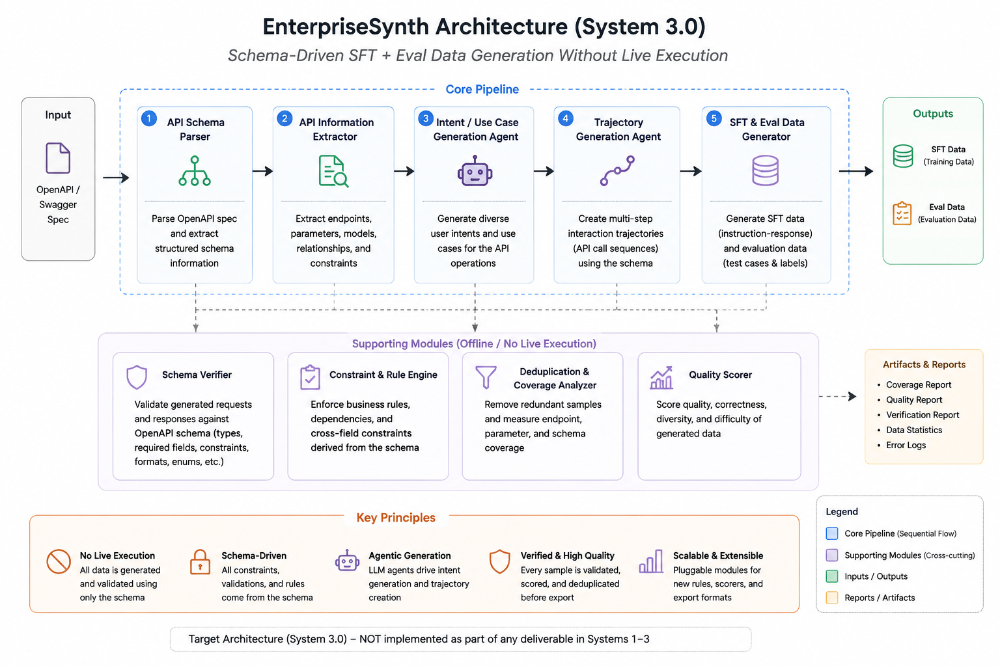

# EnterpriseSynth: Agentic SFT + Eval Data from API Schemas Without Live Execution

[](https://www.python.org/downloads/)

> **How do you generate verified, tool-use training data for an internal API that has no traffic history, no safe sandbox, and no existing SFT data, without ever calling it live?**

## Abstract

Tool-using large language model agents require substantial training and evaluation data, yet
collecting execution traces from enterprise APIs is often unsafe, expensive, or infeasible because
of access controls, compliance constraints, rate limits, and the risk of modifying production data.
EnterpriseSynth is a zero-execution framework that converts OpenAPI specifications into supervised
fine-tuning trajectories and paired evaluation instances without invoking the underlying APIs. The
framework uses a four-stage pipeline for specification parsing, intent generation, trajectory
synthesis, and static validation. Each generated trajectory is checked against the source
specification for endpoint, parameter, type, and schema consistency before being admitted to the
dataset. Evaluated on 17 real and synthetic APIs, adversarial refinement increases the validator's
detection rate for planted schema violations from 57–80% to 98% (43/44). Across five random seeds,
a compact open-weight model fine-tuned on EnterpriseSynth data outperforms both an untuned model
and a Self-Instruct baseline on held-out APIs, with performance holding on five private,
hand-authored API specifications never available during training (40.0% vs. 39.6% on the public
held-out set). An independent LLM-based evaluation shows endpoint-selection accuracy substantially
overestimates end-to-end correctness — falling from 48.9% to 21.3% once argument selection and
values are also evaluated — highlighting the need for argument-level evaluation when assessing
deployment readiness.

EnterpriseSynth is a research framework that ingests an OpenAPI/Swagger spec and emits paired,
verified SFT training traces and evaluation records — without executing a single live call
against the target API. It targets the **enterprise cold-start problem**: teams that have an API
schema but no historical tool-use data or eval suite to fine-tune or test an agent against. The
repository supports both in-repo experiment reproduction (deterministic scripts producing
committed JSON results) and paper-oriented workflows.

---

## The Problem

Fine-tuning an LLM agent to call an API reliably needs training data: instructions paired with
correct tool calls. The two existing ways to generate that data don't work behind an enterprise
firewall:

- **Execution-based generation** (API-Bank, ToolLLM/ToolBench) grounds and verifies every example
  by actually calling the API. That needs a live sandbox, which mostly doesn't exist for internal
  enterprise systems, and risks hitting production with synthetic traffic.
- **Execution-free generation** (AgentInstruct) avoids calling anything, but when it isn't seeded
  from a real spec it **hallucinates the API surface** — the LLM invents endpoints, parameters, and
  responses that don't exist — and its verification is a soft editorial pass plus a post-hoc judge,
  not a hard structural check.

A team with a brand-new internal API — a schema, but no traffic history, no sandbox, and no
existing training or eval data — has no safe way to bootstrap an agent for it. Full problem framing
against the literature ("The Execution Paradox") is in `DESIGN_DOC.md` §2.

## The Solution

EnterpriseSynth takes an OpenAPI/Swagger spec as its *only* input and emits two paired artifacts —
a verified SFT training set and an evaluation set — without ever making a live call. Grounding in
a real spec removes AgentInstruct's hallucination failure mode; a deterministic, per-sample schema
verifier (not an LLM judge) replaces execution as the correctness check.

The target design for the full system is five pipeline stages plus four supporting modules:

<p align="center">
  
</p>

**This is the target architecture —.** What's actually implemented and
measured in this repo is a narrower **four-stage** pipeline (see `DESIGN_DOC.md` §4 and §8 for the
full real-vs-planned accounting):

1. **API Schema Parser** — reads the OpenAPI/Swagger spec and extracts endpoints, parameters,
   auth requirements, and response schemas.
2. **Intent Generation Agent** — synthesizes diverse, realistic natural-language user intents for
   the parsed endpoints (Claude Sonnet 5).
3. **Trajectory Generation Agent** — turns an intent into a full trace: reasoning, the selected
   tool call, its arguments, and the expected response — picking the right endpoint out of a
   candidate list that includes distractors.
4. **Schema Verification Engine** — a deterministic, code-based gate (no LLM) that checks every
   generated trajectory against the spec itself: does the endpoint exist, is the method right, are
   required parameters present with the correct types, does the response match the schema.

---

## What This Repository Contributes

**Key contributions**, against the closest prior methods (API-Bank, ToolLLM/ToolBench,
AgentInstruct):

- **Real-spec grounding** — trajectories are generated directly from the target OpenAPI spec, not
  from text or code, so there is nothing to hallucinate (unlike AgentInstruct when seeded from code).
- **A hard, per-sample verification gate** — a deterministic, non-LLM structural check against the
  schema itself, not a soft editorial pass or post-hoc judge (unlike AgentInstruct's
  Suggester-Editor-plus-Orca-Bench design).
- **No dependency on live execution at any stage** — unlike API-Bank and ToolBench, both of which
  ground their training data in real API calls.
- **Jointly-emitted SFT + eval data** from a single generation pass, evaluated on 17 real and
  synthetic APIs including a private, never-published cold-start validation set.

EnterpriseSynth focuses on four research questions:

- **RQ1 (feasibility):** Can structurally valid, verifiable multi-step agent traces be synthesized
  from an OpenAPI spec alone — no execution, no historical request/response data?
- **RQ2 (verification):** Does a static constraint validator (schema/type/format checking, no
  runtime calls) catch the same class of errors that execution-based verification catches, and
  where does it fall short?
- **RQ3 (utility):** Does fine-tuning a compact open model on EnterpriseSynth-generated traces
  measurably improve API sequencing accuracy versus the untuned baseline and a real Self-Instruct
  baseline?
- **RQ4 (cold-start generalization):** Given a spec the base model has plausibly never seen paired
  training data for, how well do zero-execution-generated SFT+eval pairs transfer — does this
  actually work for a *new* organization's API on day one?

The current repository includes:

- A four-stage generation pipeline (Parser → Intent Agent → Trajectory Agent → Verifier) with a
  deterministic, per-sample structural verification gate, not an LLM judge
- A real Self-Instruct baseline, reimplemented per its published protocol and fine-tuned/evaluated
  on the identical held-out set as EnterpriseSynth
- A 5-seed multi-API scaling sweep (Zoom, DigitalOcean, Spotify) with real mean ± std, not
  single-draw numbers
- A private cold-start validation set: 5 hand-authored, never-published synthetic enterprise
  specs (CRM, HRIS, Procurement, Ticketing, Asset Management) that the base model cannot have seen
  in pretraining
- A 6-API real-spec scale-up via APIs.guru (Twilio, Notion, OpenAI, Jira, Asana, Trello) — 17 total
  APIs touched by the pipeline
- An independent LLM-as-a-judge semantic evaluation (Claude Haiku 4.5) that stress-tests the
  headline accuracy numbers rather than just repeating them

---

## Current Status

| Experiment | Current status | Best entrypoint |
| --- | --- | --- |
| Exp 1: schema understanding | Measured, no API key needed | `scripts/run_experiment1.py` |
| Exp 2: intent generation | Measured (Claude Sonnet 5) | `scripts/run_experiment2.py` |
| Exp 3: trajectory generation | Measured; depends on Exp 2's output | `scripts/run_experiment3.py` |
| Exp 4: schema verification | Measured, adversarially tested | `scripts/run_experiment4.py` |
| Exp 5: downstream fine-tuning | Measured pilot + 5-seed scaling sweep | `scripts/scale_experiment5_heldout.py` |
| Ablation study A1–A5 | Measured against the real 4-stage implementation | `scripts/run_ablation_study.py`, `scripts/run_ablation_haiku.py` |
| Self-Instruct baseline | Measured, real reimplementation | `scripts/run_baseline_selfinstruct.py` |
| Private cold-start validation | Measured — 5 never-published enterprise specs | `scripts/run_private_coldstart_eval.py` |
| 6-API real-spec scale-up | Measured — Twilio/Notion/OpenAI/Jira/Asana/Trello | `scripts/run_phase3_eval.py` |
| LLM-as-a-judge semantic eval | Measured — independent stress test of headline numbers | `scripts/run_llm_judge_eval.py` |

Useful repository documents:

- [DESIGN_DOC.md](DESIGN_DOC.md) — full design, literature review, methodology, all measured results
- [RESULTS.md](RESULTS.md) — consolidated measured results, one section per experiment
- [REPRODUCIBILITY.md](REPRODUCIBILITY.md) — environment, seeds, and exact reproduction steps
- [REVIEW.md](REVIEW.md) — self-audit of the repo against its own claims
- [BLOG.md](BLOG.md) — companion blog post covering the core thesis and results
- [data/README.md](data/README.md) — dataset provenance (APIs.guru sampling, private specs)
- [examples/end_to_end_walkthrough.md](examples/end_to_end_walkthrough.md) — one real endpoint through all four stages
- [literature-review/README.md](literature-review/README.md) — the five-paper review this design is built against

---

## Current In-Repo Findings

These are the current repo-verified findings, not a claim that every paper-ready external
measurement has been finalized:

- **Verification is necessary, not optional:** 0% → 100% detection of planted structural errors,
  only reached 100% after adversarial testing surfaced and forced fixes to 4 real bugs.
- **Fine-tuning effect, 5-seed sweep:** averaged over 5 training seeds, EnterpriseSynth-tuned data
  beats both an untuned base and a real Self-Instruct baseline on all 3 public held-out APIs
  (Zoom, DigitalOcean, Spotify) — individual seeds still vary, reported honestly either way.
- **Private cold-start validation:** on 5 hand-authored, never-published enterprise API specs,
  EnterpriseSynth-tuned accuracy (40.0%) essentially matches public held-out accuracy (39.6%) — no
  meaningful degradation on APIs the base model cannot have seen in pretraining.
- **6-API real-spec scale-up:** wins on all 6 new real public APIs tested (Twilio, Notion, OpenAI,
  Jira, Asana, Trello) — 17 total APIs touched by the pipeline.
- **The honest caveat on all of the above:** an independent LLM-as-a-judge evaluation found that
  binary Tool Selection Accuracy overstates practical quality by roughly 2× — 61% of predictions
  marked "correct" by the endpoint-only metric still had a real defect, usually a missing or
  hallucinated parameter. Every accuracy number above should be read as an upper bound on
  deployment readiness, not an estimate of it.

---

## Dataset

EnterpriseSynth's dataset is generated by the pipeline itself, not hand-labeled. See
[data/README.md](data/README.md) for full provenance; summary:

- **APIs used:** 17 total — GitHub, Stripe, Slack (training, 845/446/174 operations); Zoom,
  DigitalOcean, Spotify, Twilio, Notion, OpenAI, Jira, Asana, Trello (9 real public held-out APIs,
  via [APIs.guru](https://apis.guru/)); CRM, HRIS, Procurement, Ticketing, Asset Management (5
  hand-authored, never-published synthetic enterprise specs, 28 endpoints total).
- **Trajectories generated:** 45 verified SFT trajectories from Experiment 3 (GitHub/Stripe/Slack),
  plus 44 deliberately corrupted variants for verifier stress-testing (Experiment 4), plus held-out
  evaluation sets per API (see `data/generated/`).
- **Schema format:** OpenAPI/Swagger (2.0 and 3.x), parsed including `$ref`-resolved and
  `requestBody`-derived parameters.
- **Split protocol:** by whole API spec, not by individual example — training APIs never overlap
  with held-out APIs. A stratified ~65-spec, 70/15/15 (train/validation/held-out) sample is the
  target scale for a non-pilot version of this study; every number in the paper is reported at the
  pilot scale actually run (see `DESIGN_DOC.md` §5.2 and `data/README.md`).
- **Data generation process:** OpenAPI Spec → Schema Parser → Intent Generation Agent → Trajectory
  Generation Agent → Schema Verification Engine → {SFT Dataset, EnterpriseSynth-Eval}, entirely
  offline after the initial spec ingestion (no live calls to the target API at any stage).
- **Verification success rate:** 100% Verification Pass Rate on valid trajectories; 98% (43/44)
  Invalid Case Detection Rate on deliberately corrupted trajectories (Table 2 in the paper).

Datasets are also published on Hugging Face: `<hf-org>/enterprisesynth-data` (link once uploaded).

---

## Results

Downstream tool-selection accuracy, LoRA fine-tuning Qwen2.5-0.5B-Instruct on 45
EnterpriseSynth-verified trajectories, evaluated against an untuned base model and a real
Self-Instruct baseline (mean ± std, 5 seeds, held-out APIs never touched during training):

| API | Base | Self-Instruct | EnterpriseSynth |
| --- | --- | --- | --- |
| Zoom | 12.5±0.0% | 23.7±10.3% | 66.2±18.0% |
| DigitalOcean | 31.2±0.0% | 37.5±21.2% | 53.7±13.7% |
| Spotify | 12.5±0.0% | 12.5±7.7% | 46.3±7.1% |

Public held-out vs. private never-published cold-start specs (base vs. EnterpriseSynth-tuned):

| Eval set | Base | EnterpriseSynth-tuned |
| --- | --- | --- |
| Public (n=48) | 18.8% | 39.6% |
| Private (n=30) | 23.3% | 40.0% |

Schema verification (Experiment 4, adversarial testing against 44 deliberately corrupted
trajectories):

| Metric | Result |
| --- | --- |
| Verification Pass Rate (valid trajectories) | 100% (45/45) |
| Invalid Case Detection Rate (corrupted trajectories) | 98% (43/44) |

All numbers above are measured at pilot scale (see (RESULTS.md) for
what these should and shouldn't be read as); none are projected or extrapolated.

---

## Quickstart

Install and run the core checks:

```bash
python3 -m venv .venv
./.venv/bin/pip install -e ".[dev]"
./.venv/bin/python -m pytest tests/ -v
```

Fastest entrypoints by task:

| Goal | Command |
| --- | --- |
| Schema parsing accuracy (no API key) | `./.venv/bin/python scripts/run_experiment1.py` |
| Intent generation (needs API key) | `./.venv/bin/python scripts/run_experiment2.py` |
| Trajectory generation (needs API key; depends on Exp 2) | `./.venv/bin/python scripts/run_experiment3.py` |
| Schema verification + corruption testing (no API key; depends on Exp 3) | `./.venv/bin/python scripts/run_experiment4.py` |
| Regenerate all figures from committed data | `./.venv/bin/python scripts/make_figures.py` |
| Regenerate the target-architecture pipeline diagram | `./.venv/bin/python scripts/make_pipeline_diagram.py` |

---

## API Key Setup

`ANTHROPIC_API_KEY` is required for every stage that calls an LLM: Experiments 2, 3, and 5, the
ablation study (A1/A3/A4/A5), the multi-API scaling sweep, the private cold-start validation, the
6-API scale-up, and the LLM-as-a-judge evaluation. Experiments 1 and 4 are pure deterministic code
and need no key at all.

1. **Get a key.** Create one at [console.anthropic.com](https://console.anthropic.com) under
   *API Keys*, and make sure the account has available credit — a
   `anthropic.BadRequestError: ... credit balance is too low` means the key itself is valid but
   the account has no funds (a billing fix on the console, not a code bug).
2. **Set it, either way works:**

   ```bash
   # Option A — .env file at the repo root (already gitignored, recommended)
   echo 'ANTHROPIC_API_KEY=sk-ant-...' > .env

   # Option B — export directly into your shell session
   export ANTHROPIC_API_KEY=sk-ant-...
   ```

3. **Load it before running any script that needs it** (only required if you used the `.env` file):

   ```bash
   set -a && source .env && set +a
   ```

4. **Which model each stage calls:** Intent Generation, Trajectory Generation, and the fine-tuning
   pipeline's generation steps use **Claude Sonnet 5**; the semantic-plausibility ablation (A5) and
   the LLM-as-a-judge evaluation use **Claude Haiku 4.5**. Neither model choice is configurable via
   flag today — swap the model string directly in the relevant script under `scripts/` or
   `code/enterprisesynth/` if you need a different one.

No API key ever reaches the target/internal API being modeled — `ANTHROPIC_API_KEY` only talks to
Claude for generation and judging. The whole point of the pipeline is that the target API itself is
never called (see [The Problem](#the-problem) above).

---

## Reproducing All Results — Step by Step

Run in order — later scripts depend on earlier ones' output. Every command assumes you're in the
repo root with the venv activated and (if needed) the API key loaded per the section above.

### 1. Sanity check (no API key, ~1 second)

```bash
./.venv/bin/python -m pytest tests/ -v
```

### 2. Core four-stage pipeline (Experiments 1–4)

```bash
./.venv/bin/python scripts/run_experiment1.py   # schema parsing — no API key needed
./.venv/bin/python scripts/run_experiment2.py   # intent generation — needs ANTHROPIC_API_KEY
./.venv/bin/python scripts/run_experiment3.py   # trajectory generation — needs API key; depends on Exp 2
./.venv/bin/python scripts/run_experiment4.py   # schema verification + corruption testing — no API key; depends on Exp 3
```

### 3. Downstream fine-tuning pilot (Experiment 5)

Needs `ANTHROPIC_API_KEY` plus local `torch`/`transformers`/`peft`/`accelerate`; downloads
Qwen2.5-0.5B-Instruct (~1GB) on first run. No GPU required — runs on Apple Silicon's MPS backend or
CPU.

```bash
./.venv/bin/pip install torch transformers peft accelerate
./.venv/bin/python scripts/prepare_experiment5_data.py
./.venv/bin/python scripts/run_experiment5.py
```

### 4. Self-Instruct baseline

Needs `ANTHROPIC_API_KEY` + `torch`/`transformers`/`peft`.

```bash
./.venv/bin/python scripts/run_baseline_selfinstruct.py
./.venv/bin/python scripts/run_baseline_selfinstruct_finetune.py
```

### 5. Multi-API scaling sweep (5 seeds)

Needs `ANTHROPIC_API_KEY` (first seed only — the rest reuse committed held-out eval sets) + local
`torch`.

```bash
./.venv/bin/python scripts/scale_experiment5_heldout.py --seed 42

for seed in 42 123 777 2025 9999; do
  ./.venv/bin/python scripts/scale_experiment5_heldout.py --seed $seed
done
./.venv/bin/python scripts/aggregate_multi_seed_scaling.py
```

### 6. Private cold-start validation

Needs `ANTHROPIC_API_KEY` + local `torch`. Generates and evaluates against 5 hand-authored,
never-published enterprise specs (CRM, HRIS, Procurement, Ticketing, Asset Management).

```bash
./.venv/bin/python scripts/generate_private_specs.py
./.venv/bin/python scripts/build_private_coldstart_eval.py
./.venv/bin/python scripts/run_private_coldstart_eval.py
```

### 7. 6-API real-spec scale-up

Needs `ANTHROPIC_API_KEY` + local `torch`. Twilio, Notion, OpenAI, Jira, Asana, Trello via
APIs.guru.

```bash
./.venv/bin/python scripts/build_phase3_eval.py
./.venv/bin/python scripts/run_phase3_eval.py
```

---

## Citation

```bibtex
@misc{enterprisesynth2026,
  title        = {EnterpriseSynth: Zero-Execution SFT and Eval Data from OpenAPI Specs},
  author       = {Anonymous Authors},
  year         = {2026},
  note         = {Preprint}
}
```

GitHub citation metadata is also provided in [CITATION.cff](CITATION.cff).

